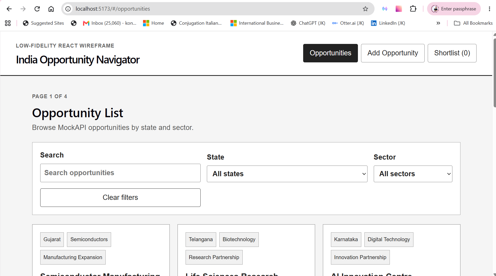
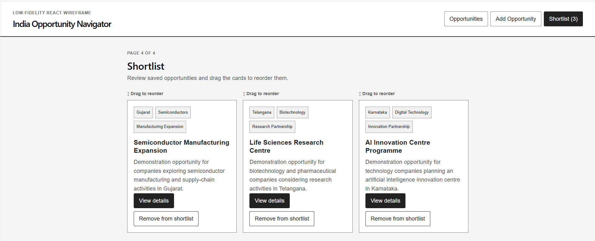

# SCTP Project India Opportunity Navigator

A React application that helps Singapore small and medium-sized enterprises (SMEs), business advisers and market researchers explore evidence-linked business opportunities across Indian states and sectors.

**Live application:** [https://sctp-india-navigator.netlify.app/](https://sctp-india-navigator.netlify.app/)

## Problem, target users and solution

### Problem

Businesses considering internationalisation into India may need to review information spread across different government websites, industry sources and market reports. This can make it difficult to identify and compare suitable opportunities efficiently.

### Target users

The application is designed for:

- Singapore SMEs exploring internationalisation opportunities in India;
- business advisers supporting market-entry decisions;
- trade and industry researchers; and
- learners studying how React can be applied to a practical business problem.

### Solution

India Opportunity Navigator provides a structured catalogue of demonstration opportunities organised by Indian state, sector and opportunity type.

Users can:

- search and filter the opportunity catalogue;
- open a detailed view of each opportunity;
- review evidence and source links;
- create a new opportunity through a controlled form;
- delete eligible user-created opportunities;
- add or remove opportunities from a shortlist; and
- reorder shortlisted opportunities using native browser drag-and-drop.

## Application screenshots

### Opportunity catalogue



### Shortlist with drag-and-drop reordering



## Main features

- Opportunity catalogue loaded from MockAPI
- Search by title, summary, state, sector or opportunity type
- State and sector filters generated from the available records
- Combined search and filtering
- Clear-filters action
- Loading, error and empty-result states
- Reusable opportunity cards
- Detailed opportunity view
- Evidence and external source links
- Controlled form for creating an opportunity
- Deletion of eligible user-created opportunities
- Shortlist add and remove actions
- Shortlist persistence using `localStorage`
- Native browser drag-and-drop shortlist reordering
- Persistence of the reordered shortlist
- Responsive interface for smaller screen widths
- Client-side routing with a Not Found fallback
- Automated component and interaction tests

## Application routes

The application uses `HashRouter` so that client-side routes work reliably when deployed as a static Netlify application.

| Route | Purpose |
|---|---|
| `#/opportunities` | Display and filter the opportunity catalogue |
| `#/opportunities/:opportunityId` | Display the complete details of one opportunity |
| `#/opportunities/new` | Display the controlled form for creating an opportunity |
| `#/shortlist` | Display and reorder shortlisted opportunities |
| Unknown route | Display the Not Found fallback |

## Technology stack

| Technology | Purpose |
|---|---|
| React | Component-based user interface and application state |
| React Hooks | State, effects and interaction handling |
| React Router | Client-side navigation |
| Vite | Development server and production build |
| MockAPI | Hosted mock opportunity data |
| `localStorage` | Shortlist and reordered-list persistence |
| Native Drag and Drop API | Shortlist reordering without a drag-and-drop library |
| Vitest | Automated test runner |
| React Testing Library | Component and user-interaction testing |
| ESLint | Static code-quality checks |
| Netlify | Public deployment |
| Git and GitHub | Version control and team collaboration |

## Module 2 learning demonstrated

| Module 2 area | Application in this project |
|---|---|
| JSX, props and composition | The interface is divided into focused components, with data and event handlers passed through props |
| `useState` | Manages opportunities, request status, filters, form values and shortlist state |
| Event handling | Handles filtering, form submission, deletion, shortlist actions and drag-and-drop |
| Lifting state up | Shared opportunity and shortlist state is managed at application level and passed to route components |
| Conditional rendering | Displays loading, error, empty-result, Not Found and successful-content states |
| Rendering lists | Maps opportunity and shortlist arrays into reusable cards |
| `useEffect` | Fetches MockAPI records and synchronises persistent shortlist data |
| React Router | Provides separate catalogue, details, form and shortlist views |
| Controlled forms | Stores each form input in React state before submission |
| External data | Reads and persists demonstration records through MockAPI |
| Git and GitHub | Uses issues, branches, pull requests, reviews and commit history |
| Automated testing | Uses Vitest and React Testing Library to verify important behaviour |

## Core-requirement checklist

- [x] Built with Vite
- [x] Uses functional React components and hooks
- [x] Organised into sensibly scoped components
- [x] Passes data and event handlers through props
- [x] Provides more than two client-side routes
- [x] Uses React Router for navigation
- [x] Manages shared application state with React hooks
- [x] Fetches data from an external mock source
- [x] Provides loading and error handling
- [x] Includes a controlled form for creating a new item
- [x] Displays a collection of opportunity records
- [x] Allows eligible user-created records to be deleted
- [x] Is deployed to a public Netlify URL

## Bonus challenges completed

### Easy

- [x] Search and filtering on the opportunity list
- [x] Loading feedback for asynchronous data
- [x] Responsive behaviour for smaller screen widths

### Medium

- [x] Automated tests with Vitest and React Testing Library

### Hard

- [x] Native browser drag-and-drop reordering of shortlist items
- [x] Persistence of the reordered shortlist in `localStorage`
- [x] No external drag-and-drop library used

## Data source and data contract

The project uses a MockAPI `opportunities` resource containing 12 curated demonstration records.

The application accesses the resource through:

```text
${VITE_API_BASE_URL}/opportunities
```

Each opportunity follows the agreed 12-field contract:

| Field | Purpose |
|---|---|
| `id` | Unique record identifier generated by MockAPI |
| `title` | Opportunity title |
| `state` | Indian state or region |
| `sector` | Industry sector |
| `opportunityType` | Type of opportunity |
| `summary` | Short catalogue description |
| `description` | Detailed explanation |
| `whyItMatters` | Business relevance |
| `recommendedAction` | Suggested next step |
| `sourceName` | Name of the evidence source |
| `sourceUrl` | External evidence link |
| `isUserCreated` | Identifies records created through the application |

MockAPI may also return service metadata such as `createdAt`. That metadata is not part of the application's required opportunity contract.

The opportunity records are curated demonstration data for learning, application development and testing. Users should verify current market, regulatory and commercial information through official sources before making business decisions.

## Local installation

### 1. Clone the repository

```bash
git clone git@github.com:Jefkong77/india-opportunity-navigator.git
cd india-opportunity-navigator
```

### 2. Install the dependencies

```bash
npm install
```

### 3. Create the local environment file

Copy `.env.example` and rename the copy to `.env.local`.

On Windows PowerShell:

```powershell
Copy-Item .env.example .env.local
```

Update `.env.local` with the assigned MockAPI base URL:

```env
VITE_API_BASE_URL=https://your-project-id.mockapi.io/api/v1
```

Do not commit `.env.local`, API credentials or private configuration values.

### 4. Start the development server

```bash
npm run dev
```

Open the local URL displayed by Vite.

## Available commands

| Command | Purpose |
|---|---|
| `npm run dev` | Start the Vite development server |
| `npm run lint` | Run ESLint checks |
| `npm run test -- --run` | Run the automated test suite once |
| `npm run build` | Create the production build |
| `npm run preview` | Preview the production build locally |

## Verification performed

The project has been verified through automated checks and browser testing.

### Technical verification

- ESLint completed successfully
- Production build completed successfully
- All 10 Vitest and React Testing Library tests passed
- Netlify deployment was accessible through the public URL

### Browser verification

- MockAPI records loaded successfully
- Search returned matching opportunities
- State and sector filters worked separately and together
- Clear filters restored the complete catalogue
- Empty search results displayed suitable feedback
- Opportunity details and evidence links were displayed
- The controlled form created a new opportunity
- Eligible user-created records could be deleted
- Opportunities could be added to and removed from the shortlist
- Shortlist order changed through native drag-and-drop
- The reordered shortlist remained in the same order after refreshing the page
- Unknown routes displayed the Not Found fallback

## Team collaboration and contributions

The project was completed through a shared GitHub repository using issues, feature branches, pull requests, reviews and a GitHub Projects board.

The contribution descriptions below recognise both early feature exploration and the later integration work needed to align the final application with the approved data contract, routes and assignment requirements.

| Team member | Contributions |
|---|---|
| Jeffrey Kong | Problem framing, research direction, MockAPI and data-contract alignment, feature integration and refinement, testing, Netlify deployment, documentation, and native drag-and-drop shortlist reordering |
| Kelvin Lee | Initial opportunity-catalogue and filtering implementations, feature exploration, implementation input, and contributions that helped shape the final application behaviour and shared learning |
| Shared work | Product discussions, GitHub issues, project-board tracking, feature branches, pull-request workflow, review, troubleshooting and application learning |

The final implementation preserves useful intentions from earlier work while keeping each completed feature aligned with the agreed interface, route structure, data contract and issue scope.

Commit history and pull requests provide the detailed technical record of individual contributions.

## AI and external-tools disclosure

AI assistants and external research tools were used to support learning, planning, debugging and review. Their output was treated as guidance rather than accepted automatically.

| Tool or source | How it supported the project |
|---|---|
| ChatGPT | Step-by-step planning, explanations, debugging assistance, code review, test guidance and documentation drafting |
| GitHub Copilot | Code suggestions and development assistance within the editor |
| Claude | Alternative explanations, implementation ideas and review support |
| Google | Discovery of relevant public information and official sources |
| Singapore Business Federation business survey | Contextual understanding of SME business sentiment and internationalisation activity, particularly interest in the India market |
| Indian government and state-government websites | Research and evidence for opportunity records |
| National Single Window System | Official supporting information and evidence links |
| MockAPI | Hosted mock data source used for create, read and delete operations |
| GitHub | Repository hosting, version control, issues, branches, pull requests and project management |
| Netlify | Public application deployment |

No AI-generated suggestion was accepted solely because it came from an AI tool. Suggested code and documentation were reviewed, adjusted, tested and discussed in relation to the Module 2 learning objectives.

No external tutorial code was knowingly copied verbatim into the project. Public websites and reports were used as research references for demonstration content and evidence links.

## Explainability and learning accountability

Every team member is responsible for understanding the submitted application and should be able to explain:

- how the React components are organised;
- how props and shared state move through the application;
- how `useEffect` retrieves external data;
- how controlled form inputs work;
- how search and filtering are calculated;
- how client-side routes are configured;
- how loading, error and empty states are rendered;
- how shortlist data is stored in `localStorage`;
- how native drag events reorder the shortlist;
- how automated tests verify behaviour; and
- how Git branches, commits and pull requests support collaboration.

The purpose of using AI and other tools was to support the team's ability to apply, test and explain the React concepts taught in Module 2.

## Limitations and future improvements

- The opportunity records are demonstration data and are not investment advice.
- Market and regulatory information may change and should be verified through official sources.
- The application does not provide real authentication or user accounts.
- `localStorage` shortlist data is limited to the current browser and device.
- MockAPI is suitable for demonstration purposes but is not a production business-data platform.
- Future versions could add authentication, record editing, richer comparison tools and a production-grade backend.